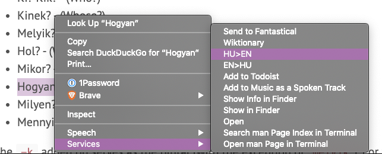
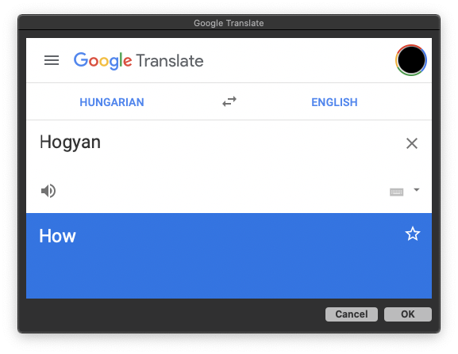

# Hungarian Automator Workflows

> Some Automator workflows for quickly translating between Hungarian and English on macOS

## Contents

This repo contains three workflows:

1. **EN-HU:** Opens a Google Translate popup that translates the selected text from English to Hungarian
2. **HU-EN:** Opens a Google Translate popup that translates the selected text from Hungarian to English
3. **Wiktionary:** Opens a popup with the Wiktionary entry for the selected word. This works for single words in any language.

## Installation

1. Clone this repo or [download it](https://github.com/localjo/hungarian-automator-workflows/archive/master.zip) and extract the files.
2. Right-click on the `.workflow` file(s) you want to install and then click "Open".
3. When asked if you are sure, click "Open" again.
4. When asked if you want to install, click "Install", or "Open with Automator" if you want to customize the workflow.

## Usage

Once these workflows have been installed, they can be used from the Services menu in apps that support them (such as a web browser) when you have selected some text in that app.

The Services menu can usually be found in three places:
  1. In the menu bar, as a sub-menu under the current app's name
  2. In the context menu, when you right-click on selected text
  3. In the touchbar, when you tap the `fn` key on your keyboard

Select some text, choose the workflow you want to run from the Services menu, and you should see a popup with the results.

## Feedback

I've been using these workflows for awhile on my own computer, but I haven't tried installing them on other computers. If you run into any issues, please leave feedback on GitHub.

Pull Requests welcome. Thanks!

## License 

The MIT License (MIT)

Copyright (c) 2020 Josiah Sprague

Permission is hereby granted, free of charge, to any person obtaining a copy of this software and associated documentation files (the "Software"), to deal in the Software without restriction, including without limitation the rights to use, copy, modify, merge, publish, distribute, sublicense, and/or sell copies of the Software, and to permit persons to whom the Software is furnished to do so, subject to the following conditions:

The above copyright notice and this permission notice shall be included in all copies or substantial portions of the Software.

THE SOFTWARE IS PROVIDED "AS IS", WITHOUT WARRANTY OF ANY KIND, EXPRESS OR IMPLIED, INCLUDING BUT NOT LIMITED TO THE WARRANTIES OF MERCHANTABILITY, FITNESS FOR A PARTICULAR PURPOSE AND NONINFRINGEMENT. IN NO EVENT SHALL THE AUTHORS OR COPYRIGHT HOLDERS BE LIABLE FOR ANY CLAIM, DAMAGES OR OTHER LIABILITY, WHETHER IN AN ACTION OF CONTRACT, TORT OR OTHERWISE, ARISING FROM, OUT OF OR IN CONNECTION WITH THE SOFTWARE OR THE USE OR OTHER DEALINGS IN THE SOFTWARE.